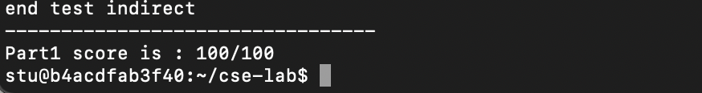
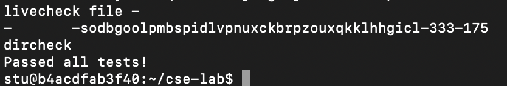
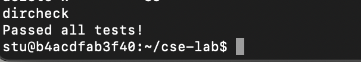
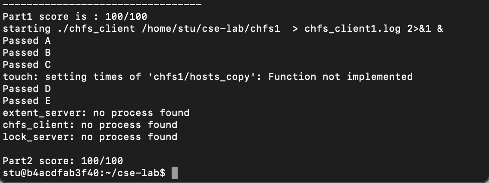

# CSE-LAB 1 : Basic File System
#### id: 519021910861
#### name: huidongxu
------

## Part 1A : Create / GetAttr
* read_block 和 write_block 用来读写硬盘
```C++
void dist::read_block(blockid_t id, const char* buf)
{
	/* memcpy(void* dst, const void* src, size_t n) */
	/* 用来复制字符串 */
	memcpy(buf, blocks[id], BLOCK_SIZE);
}
void disk::write_block(blockid_t id, const char* buf)
{
	memcpy(blocks[id], buf, BLOCK_SIZE);
}
```

* alloc_inode 用来分配 inode
```C++
uint32_t inode_manager::alloc_inode(uint32_t type)
{
	/* 静态变量用来记录已经分配过的 inode num */
	static int inum = 0;
	
	for (int i = 0; i < INODE_NUM; i++)
	{
		inum = (inum + 1) % INODE_NUM; /* 每次查询下一个 inum*/
		inode_t* ino = get_inode(inum);
		if (!ino) { /* 如果查询不到则代表这个 inum 可用 */
			ino = (inode_t*) malloc (sizeof(inode_t));
			bzero(ino, sizeof(inode_t)); /* 将 ino 区域置零 */
			ino->type = type;
			ino->atime = ino->mtime = ino->ctime = (unsigned int) time (NULL);
			put_inode(inum, ino); /* 将 inode 写入磁盘 */
			free(ino); /* 释放 ino，防止内存泄漏 */
			break;
		};
		free(ino);
	};
	assert(inum != 0); /* inum 从 1 开始分配，为确保递增当循环使用时需报错 */
	return inum;
}
```

* getattr 用来获得 inode 信息
```C++
void inode_manager::getattr(uint32_t inum, extent_protocol::attr& a)
{
	inode_t* ino = get_inode(inum);
	if (ino == NULL) return;
	a.type = ino->type;
	a.atime = ino->atime;
	a.mtime = ino->mtime;
	a.ctime = ino->ctime;
	a.size = ino->size;
	free(ino);
	return;
}
```

## Part 1B : Put / Get
* alloc_block 用来分配 block
```C++
blockid_t block_manager::alloc_block()
{
	for (int i = FILEBLOCK; i < BLOCK_NUM; i++)
		if (!using_blocks[i]) {
			using_blocks[i] = true;
			return i; /* 分配成功 */
		};
	return 0; /* 分配失败 */
}
```

* free_block 用来释放 block
```C++
void block_manager::free_block(uint32_t id)
{
	using_blocks[id] = false;
	return;
}
```

* alloc_nth_block 分配 block 辅助用
```C++
void inode_manager::alloc_nth_block(inode_t* ino, uint32_t n)
{
	char buf[BLOCK_SIZE];
	assert(ino);
	
	if (n < NDIRECT) ino->blocks[n] = bm->alloc_block(); /* 直接分配 */
	else if (n < MAXFILE) {
		if (!ino->blocks[NDIRECT]) {
			ino->blocks[NDIRECT] = bm->alloc_block(); /* 先分配非直接映射空间 */
		};
		/* 在 blocks[NDIRECT] 中存放 blockid_t */
		bm->read_block(ino->blocks[NDIRECT], buf);
		((blockid_t*)buf)[n - NDIRECT] = bm->alloc_block();
		bm->write_block(ino->blocks[NDIRECT], buf);
	} else exit(0);
}
```

* get_nth_blockid 获得 blockid 辅助用
```C++
blockid_t inode_manager::get_nth_blockid(inode_t *ino, uint32_t n)
{
	char buf[BLOCK_SIZE];
	blockid_t res;
	
	assert(ino);
	if (n < NDIRECT) res = ino->blocks[n];
	else if (n < MAXFILE) {
		bm->read_block(ino->blocks[NDIRECT], buf);
		res = ((blockid_t*)buf)[n - NDIRECT];
	} else exit(0);
	return res;
}
```
* write_file 用来写入一个文件
```C++
void inode_manager::write_file(uint32_t inum, const char* buf, int size)
{
	int block_num = 0;
	int remain_size = 0;
	int old_blocks, new_blocks;
	char temp[BLOCK_SIZE];
	int i = 0;
	
	/* 先判断该文件大小是否能够写入文件系统 */
	assert(size >= 0 && (uint32_t)size <= MAXFILE * BLOCK_SIZE);
	
	inode_t *ino = get_inode(inum);
	if (ino) { /* 释放原先文件 */
		assert((unsigned int)size <= MAXFILE * BLOCKSIZE);
		assert(ino->size <= MAXFILE * BLOCKSIZE);
		/* 计算原先和现在所需 block 的数量 */
		old_blocks = ino->size == 0 ? 0 : (ino->size - 1) / BLOCKSIZE + 1;
		new_blocks = size == 0 ? 0 : (size - 1) / BLOCKSIZE + 1;
		if (old_blocks < new_blocks)
			for (int j = old_blocks; j < new_blocks; j++) alloc_nth_block(ino, j);
		else if (old_blocks > new_blocks)
			for (int j = new_blocks; j < old_blocks; j++)
				bm->free_block(get_nth_blockid(ino, j));
		
		block_num = size / BLOCK_SIZE;
		remain_size = size % BLOCK_SIZE;
		
		for (; i < block_num; i++)
			bm->write_block(get_nth_blockid(ino, i), buf + i * BLOCK_SIZE);
		if (remain_size) {
			/* 将剩余的字符拷贝到 BLOCK_SIZE 大小的 buf 中并写入 */
			memcpy(temp, buf + i * BLOCK_SIZE, remain_size);
			bm->write_block(get_nth_blockid(ino, i), temp);
		}
		
		ino->size = size;
		ino->atime = ino->mtime = ino->ctime = (unsigned ino) time (NULL);
		put_inode(inum, ino);
		free(ino);
	};
	return;
}
```
* read_file 用来读取一个文件
```C++
void inode_manager::read_file(uint32_t inum, char** buf_out, int* size)
{
	int block_num = 0;
	int remain_size = 0;
	char buf[BLOCK_SIZE];
	int i = 0;
	
	inode_t* ino = get_inode(inum);
	if (ino) {
		*size = ino->size;
		*buf_out = (char*)malloc(*size);
		
		block_num = *size / BLOCK_SIZE;
		remain_size = *size & BLOCK_SIZE;
		
		for (; i < block_num; i++) {
			bm->read_block(get_nth_blockid(ino, i), buf);
			memcpy(*buf_out + i * BLOCK_SIZE; buf, BLOCK_SIZE);
		}
		if (remain_size) { /* 剩余不足 BLOCK_SIZE 的单独处理 */
			bm->read_block(get_nth_blockid(ino, i), buf);
			memcpy(*buf_out + i * BLOCK_SIZE, buf, remain_size);
		}
		free(ino);
	}
}
```

## Part 1C : Remove
* free_inode 释放 inode
```C++
void inode_manager::free_inode(uint32_t inum)
{
	inode_t *ino = get_inode(inum);
	if (ino) {
		assert(ino->type != 0);
		ino->type = 0;
		put_inode(inum, ino);
		free(ino);
	}
}
```

* remove_file 删除文件
```C++
void inode_manager::remove_file(uint32_t inum)
{
	inode_t *ino = get_inode(inum);
	int block_num = ino->size == 0 ? 0 : (ino->size - 1) / BLOCK_SIZE + 1;
	/* 释放所有的 block */
	for (int i = 0; i < block_num; i++) bm->free_block(get_nth_blockid(ino, i));
	/* 释放写有 indirect block 的 block */
	if (block_num > NDIRECT)
		bm->free_block(ino->blocks[NDIRECT]);
	bzero(ino, sizeof(inode_t));
	/* 释放 inode */
	free_inode(inum);
	free(ino);
	return;
}
```
## Part 1 Score
```bash
make
sudo ./part1_tester
```


## Part 2A : Create / Mknod  Lookup  ReadDir
* create 创建一个文件
```C++
int chfs_client::create(inum parent, const char* name, mode_t mode, inum& ino_out)
{
	int r = OK;
	/* check if file has existed */
	bool found = false;
	inum tmp;
	lookup(parent, name, found, tmp);
	if (found) return EXIST;
	
	/* pick an inum */
	ec->create(extent_protocol::T_FILE, ino_out);
	/* add an entry into parent */
	std::string buf;
	ec->get(parent, buf);
	buf.append(std::string(name) + ":" + filename(ino_out) + "/");
	ec->put(parent, buf);
	return r;
}
```

* lookup 查询一个文件是否存在
```C++
int chfs_client::lookup(inum parent, const char* name, bool &found, inum& ino_out)
{
	int r = OK;
	
	std::list<dirent> list;
	readdir(parent, list);
	
	if (list.empty()) {
		found = false;
		return r;
	};
	
	for (std::list<dirent>::iterator it = list.begin(); it != list.end(); it++) {
		if (it->name.compare(name) == 0) { /* find */
			found = true;
			ino_out = it->inum;
			return r;
		}
	};
	found = false;
	return r;
}
```

* readdir 读取一个文件夹中的文件
```C++
int chfs_client::readdir(inum dir, std::list<dirent>& list)
{
	int r = OK;
	std::string buf;
	ec->get(dir, buf);
	
	/* my format of dir content: "name:inum/name:inum/name:inum/" */
	int name_start = 0;
	int name_end = buf。find(':');
	while (name_end != std::string::npos) {
		/* 获取文件 name 和 inum */
		std::string name = buf.substr(name_start, name_end - name_start);
		int inum_start = name_end + 1;
		int inum_end = buf.find('/', inum_start);
		std::string inum = buf.substr(inum_start, inum_end - inum_start);
		
		struct dirent entry;
		entry.name = name;
		entry.inum = n2i(inum);
		
		list.push_back(entry);
		
		name_start = inum_end + 1;
		name_end = buf.find(':', name_start);
	};
	return r;
}
```

## Part 2A Result
```bash
make
sudo ./start.sh
sudo ./test-lab1-part2-a.pl ./chfs1
```


## Part 2B : SetAttr  Read  Write
* setattr 设置文件元数据
```C++
int chfs_client::setattr(inum ino, size_t size)
{
	int r = OK;
	
	std::string buf;
	ec->get(ino, buf);
	buf.resize(size); /* 改变 buf 大小 */
	ec->put(ino, buf);
	
	return r;
}
```

* fuseserver_setattr 设置文件元数据，更高层
```C++
void fuseserver_setattr(fuse_req_t req, fuse_ino_t ino, struct stat* attr, int to_set, struct fuse_file_info* fi)
{
	if (FUSE_SET_ATTR_SIZE & to_set) {
		struct stat st;
		if (to_set & FUSE_SET_ATTR_SIZE) chfs->setattr(ino, attr->st_size);
		getattr(ino, st);
		fuse_reply_attr(req, &st, 0);
	} else fuse_reply_err(req, ENOSYS);
}
```

* read 读取一个文件
```C++
int chfs_client::read(inum ino, size_t size, off_t off, std::string& data)
{
	int r = OK;
	std::string buf;
	ec->get(ino, buf); /* 读取整个文件 */
	/* off 超出范围 */
	if (off > buf.size()) {
		data = "" 
		return r;
	};
	/* 部分超出范围，则截取子串 */
	if (off + size) > buf.size())	 {
		data = buf.substr(off);
		return r;
	};
	/* 正常情况 */
	data = buf.substr(off, size);
	return r;
}
```

* fuseserver_read 读取，更高层次
```C++
void
fuseserver_read(fuse_req_t req, fuse_ino_t ino, size_t size,
        off_t off, struct fuse_file_info *fi)
{
    std::string buf;
    int r;
    if ((r = chfs->read(ino, size, off, buf)) == chfs_client::OK) {
        fuse_reply_buf(req, buf.data(), buf.size());
    } else {
        fuse_reply_err(req, ENOENT);
    }
```

* write 写文件
```C++
int chfs_client::write(inum ino, size_t size, off_t off, const char* data, size_t& bytes_written)
{
	int r = OK;
	std::string buf;
	ec->get(ino, buf);
	
	if (off + size <= buf.size()) {
		for (int i = off; i < off + size; i++) buf[i] = data[i - off];
		bytes_written = size;
		ec->put(ino, buf);
		return r;
	};
	buf.resize(off + size); /* 改变 buf 大小 */
	for (int i = off; i < off + size; i++) buf[i] = data[i - off];
	bytes_written = size;
	ec->put(ino, buf);
	return r;
}
```

* fuseserver_write 写文件，更高层次
```C++
void
fuseserver_write(fuse_req_t req, fuse_ino_t ino,
        const char *buf, size_t size, off_t off,
        struct fuse_file_info *fi)
{
    int r;
    if ((r = chfs->write(ino, size, off, buf, size)) == chfs_client::OK) {
        fuse_reply_write(req, size);
    } else {
        fuse_reply_err(req, ENOENT);
    }
}
```

## Part 2B Result
```bash
make
sudo ./start.sh
sudo ./test-lab1-part2-2b.pl ./chfs1
```


## Part 2C : MkDir  Unlink
* mkdir 创建文件夹
```C++
int chfs_client::mkdir(inum parent, const char* name, mode_t mode, inum& ino_out)
{
	int r = OK;
	
	/* 类似于 create，文件类型改一下 */
	/* check if dir name has existed */
	bool found = false;
	inum tmp;
	lookup(parent, name, found, tmp);
	if (found) return EXIST;
	
	/* pick an inum */
	ec->create(extent_protocol::T_DIR, ino_out);
	
	/* add an entry into parent */
	std::string buf;
	ec->get(parent, buf);
	buf.append(std::string(name) + ":" + filename(ino_out) + "/");
	ec->put(parent, buf);
	return r;
}
```

* unlink 删除链接
```C++
int chfs_client::unlink(inum parent, const char* name)
{
	int r = OK;
	
	bool found = false;
	inum inum;
	lookup(parent, name, found, inum);
	ec->remove(inum);
	
	/* update parent directory content */
	std::string buf;
	ec->get(parent, buf);
	int erase_start = buf.find(name);
	int erase_after = buf.find('/', erase_start);
	buf.erase(erase_start, erase_after - erase_start + 1);
	ec->put(parent, buf);
	
	return r;
}
```

## Part 2C Result
```bash
make
sudo ./start.sh
sudo ./test-lab1-part2-c.pl ./chfs1
```


## Part 2D : Symlink  Readlink
* symlink 建立链接
```C++
int chfs_client::symlink(inum parent, const char* name, const char* link, inum &ino_out)
{
	int r = OK;
	

/* check if symlink name has existed */
	bool found = false;
	inum tmp;
	lookup(parent, name, found, tmp);
	if (found) return EXIST;
	
	/* pick an inum and init the symlink */
	ec->create(extent_protocol::T_SYMLINK, ino_out);
	ec->put(ino_out, std::string(link));
	
	/* add an entry into parent */
  std::string buf;
  ec->get(parent, buf);
  buf.append(std::string(name) + ":" + filename(ino_out) + "/");
  ec->put(parent, buf);
  return r;
}
```

* fuseserver_symlink 建立链接，更高层次
```C++
void fuseserver_symlink(fuse_req_t req, const char *link, fuse_ino_t parent, const char *name)
{
  chfs_client::inum id;
  chfs_client::status stat;
  struct fuse_entry_param e;

  stat = chfs->symlink(parent, name, link, id);
  if (stat != chfs_client::OK) {
    if (stat == chfs_client::EXIST) {
      fuse_reply_err(req, EEXIST);
    } else {
      fuse_reply_err(req, ENOENT);
    }
    return;
  }

  e.ino = id;
  e.attr_timeout = 0.0;
  e.entry_timeout = 0.0;
  e.generation = 0;

  if (getattr(id, e.attr) != chfs_client::OK) {
  	fuse_reply_err(req, ENOENT);
  	return;
	}
  fuse_reply_entry(req, &e);
}
```

* readlink 读取链接内容
```C++
int chfs_client::readlink(inum ino, std::string &data)
{
	int r = OK;
	std::string buf;
	ec->get(ino, buf);
	
	data = buf;
	return r;
}
```

* fuseserver_readlink 读取链接内容，更高层次
```C++
void fuseserver_readlink(fuse_req_t req, fuse_ino_t ino)
{
  std::string buf;

  if (chfs->readlink(ino, buf) != chfs_client::OK) {
    fuse_reply_err(req, ENOENT);
    return;
  }
  fuse_reply_readlink(req, buf.c_str());
}
```

* fuse.cc main 函数中记得添加
```C++
fuseserver_oper.symlink = fuseserver_symlink;
fuseserver_oper.readlink = fuseserver_readlink;
```

## Grading
```bash
make
sudo ./grade.sh
```


## Handin Procedure
```bash
make handin
mv lab.tgz lab1_519021910861.tgz
```
