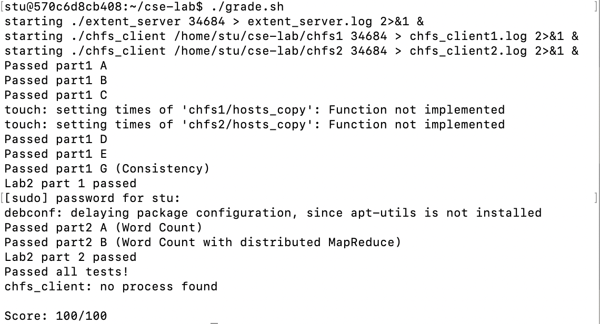

# CSE-Lab 2
#### id: 519021910861
#### name: huidong xu
------

## Distributed File Server
将原先本地的文件系统变成分布式的，所以需要用 rpc 。如果第一个 lab 完成正常，此处则仅需修改 extent_client.cc 。我们以 create 函数为例，其他函数以此类推。
```c++
extent_protocol::status
extent_client::create(uint32_t type, extent_protocol::extentid_t &id)
{
	extent_protocol::status ret = extent_protocol::OK;
	ret = cl->call(extent_protocol::create, type, id);
	VERIFY(ret == extent_protocol::OK);
	return ret;
}
```

## MapReduce

### Task 1: 在 mr_sequential.cc 中完成一个简单的 map-reduce 模型。

* map 的作用是将某个文件的所有单词转换成 "单词 空格 次数 换行" 的格式并写入中间数组中，且此处仅需顺序遍历，无需将相同单词进行合并，所以出现在中间数组中的单词次数均为 1 。
```c++
vector<KeyVal> Map(const string &filename, const string &content)
{
	vector<Keyval> ret;
	l <- 0, r <- 0;
	while content[r] != '\0':
		if content[r] is EngAlpha: r++
		else
			str <- content.substr(l, r - l);
			ret.push_back({key: str, val: "1"});
			while (content[r] != '\0' && content[r] is not EngAlpha) r++;
			l <- r;
	return ret;
}
```

* reduce 的作用是将中间数组的重复单词进行合并。这里的 val 值均是以字符串出现，又要当做数字相加因此需要进行转换。
```c++
string Reduce(const string& key, const vector<string> &values)
{
	ret <- "0"
	for val in values:
		ret <- strPlus(ret, val)
	return ret
}
```

* main 函数则先将所有文件的单词进行 map 转换，然后再对中间数组进行排序让相同的单词相邻，再每次截取相邻相同的单词进行 reduce 合并，最终得到结果。
```c++
int main(int argc, char **argv)
{
	vector <KeyVal> intermediate <- empty
	
	for i = 1 : argc
		filename <- argv[i]
		getline(...) /* 读取文件全部内容 */
		/* 进行 map 转换 */
		content <- ""
		vector <KeyVal> KVA = Map(filename, content)
		intermediate.insert(KVA)
		
	sort(intermediate ...) /* 对中间数组进行排序 */
	
	for i = 0 : intermediate.size
		j <- i + 1
		while j < intermediate.size && intermediate[i].key == intermediate[j].key: j++
		vector<string> values <- empty
		values.push_back(intermediate[i].key, intermediate[i + 1].key, ... intermediate[j - 1].key)
		output = Reduce(intermediate[i].key, values)
		... /* 写入输出文件 */
	
	return 0
}
```

### Task 2: 在 mr_coordinator 和 mr_worker 中完成一个分布式的 map-reduce 模型。

#### worker: 打工人，接任务做任务，提交等待下一个任务。

测评时会开 4 个线程进行 worker 的模拟，因此 worker 需要每次将结果写入中间文件，根据 reducer 的数量我们需要将 worker 中的单词尽量均分到相应数量的文件中。

为了加速运行，在 map 中我们应该先将所有条目附加到一个 string 中，再一次性写入文件。
```c++
contents[reduce] += intermediate[i].key + ' ' + intermediate[i].val + '\n';
```

在 reduce 中我们应该将读取相应的中间文件，并进行归并相同单词。为了加速，我们不能使用 part1 中的 sort 函数，而是采用 unordered_map 进行计数。
```c++
unordered_map<string, uint64_t> intermediate
while (file >> key >> val)
	intermediate[key] += atoll(val.c_str())
```

在归并完成后，我们再将哈希表中的所有元素集中到一个 string 中。
```c++
while (iter != intermediate.end()) {
	content += iter->first + ' ' + to_string(iter->second) + '\n';
	iter++;
}
```

最后，我们将 content 一次性写入最终文件。注意文件要以追加模式打开，不然不同的 reducer 会相互覆盖写入的内容。
```c++
ofstream write("mr-out", ios::out | ios::app);
write << content;
write.close();
```

#### coordinater: 领导者，分配任务，接受打工人的汇报，决定是否结束

领导者因为要给多个打工人分配任务，所以在查询任务并且分配时数据需要上锁。
```c++
bool Coordinator::assignTask(Task& task) {
	this->mtx.lock();
	first. find not assigned map task, if find then break
	second. find not assigned reduce task, if find then break
	else. break
	this->mtx.unlock();
	return
};
```

利用 rpc 远程传输时，数据结构如下。
```c++
struct AskTaskResponse {
	mr_tasktype taskType;
	int index;
	vector<string> readfiles;
};
```

在接受打工人提交时，也需要对数据上锁，防止被多个 worker 读取。
```c++
mr_protocol::status Coordinator::submitTask(int taskType, int index, bool &success) {
	this->mtx.lock();
	get corresponding task finish
	add completeXXX
	this->mtx.unlock();
}
```

## 结果
